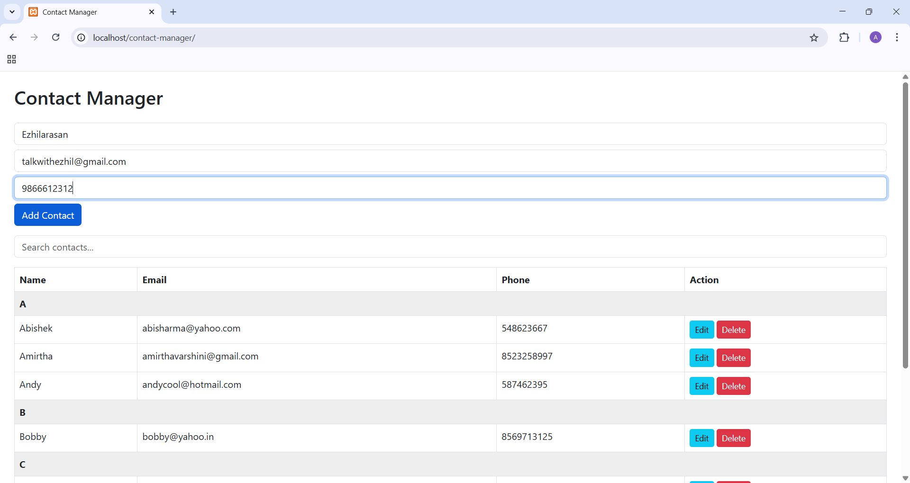
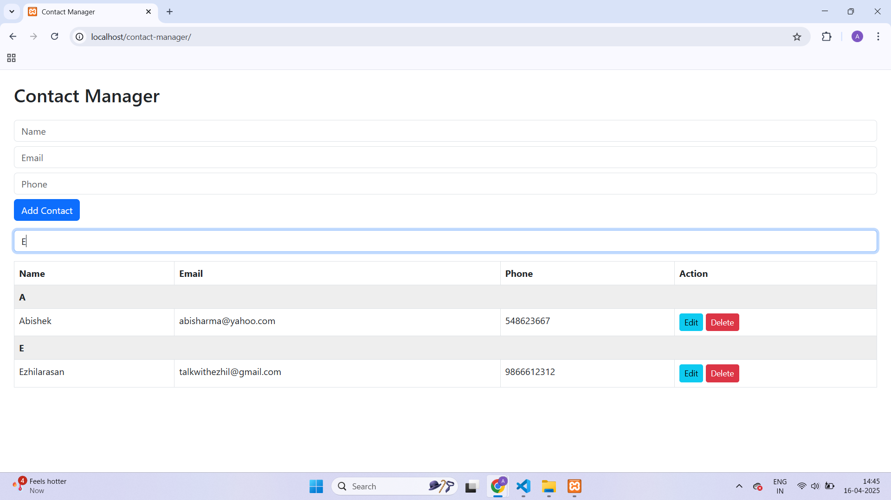

# 📇 Contact Manager App (LAMP + jQuery)

A clean and interactive **Contact Manager Web App** built with the **LAMP stack (Linux, Apache, MySQL, PHP)** and enhanced with **jQuery**.

This project demonstrates full **CRUD operations**, **live search**, and **alphabetical grouping**, making it an ideal mini-project for portfolios, resumes, and interview showcases.

---

## 🚀 Features

- ✅ Add new contact (Name, Email, Phone)
- ✅ View contacts grouped alphabetically (A–Z)
- ✅ Live search filter with jQuery
- ✅ Inline editing & updating of contact details
- ✅ Delete contact functionality
- ✅ Clean Bootstrap UI with responsive layout

---

## 🛠️ Tech Stack

- **Frontend**: HTML5, CSS3, Bootstrap, jQuery
- **Backend**: PHP (Procedural)
- **Database**: MySQL
- **Web Server**: Apache
- **Platform**: LAMP (Linux-compatible setup)

---

## 📸 Screenshots

### ➕ Add Contact


### 🔍 Search Contact


### ✏️ Edit Contact


---

## 🧪 How to Run Locally

1. 🔽 Download or clone the repo:
   ```bash
   git clone https://github.com/your-username/contact-manager-app.git

2. 🗂️ Move the project to your local Apache server directory (htdocs for XAMPP or /var/www/html for Linux).

3. 🛢️ Import the contact_app.sql file into your MySQL (you can export it from your working DB).

4. 🔧 Update db.php with your local DB credentials.

5. ▶️ Open the project in your browser:
    copy
    http://localhost/contact-manager-app/

📦 Folder Structure
contact-manager-app/
├── index.html
├── script.js
├── style.css
├── db.php
├── add_contact.php
├── get_contacts.php
├── delete_contact.php
├── update_contact.php
└── screenshots/
    ├── add-contact.png
    ├── search.png
    └── edit.png
🌐 Live Demo (Coming Soon)
A live demo link will be added after hosting it on a Linux server like 000webhost or InfinityFree.

🧑‍💻 Author
👩‍💻 Vagini Alagarsamy
🔗 GitHub
🔗 LinkedIn

📩 Want to Contribute?
Feel free to fork, suggest features, or drop a ⭐ if you found this project useful!
